# Three-test-suite アーキテクチャ

## 1. 概要

Three-test-suiteは、Three.jsアプリケーションの包括的なテストを可能にする4層アーキテクチャを採用しています。Node.js環境でのDOM・WebGL制約を解決し、テストの独立性を確保しながら、開発者がThree.jsのテストロジックに集中できる環境を提供します。

### 🎯 核心的価値
- **技術的制約の抽象化**: DOM・WebGL環境の自動提供
- **テストの独立性**: 各テスト間の完全分離
- **開発者体験の向上**: IDE支援を活用したテスト記述
- **高い再利用性**: モジュラー設計による柔軟な組み合わせ

## 2. 四部構成アーキテクチャ

### 2.1 基盤層 (Infrastructure Layer)
**役割**: ブラウザ環境とPuppeteerの基本機能を提供する土台

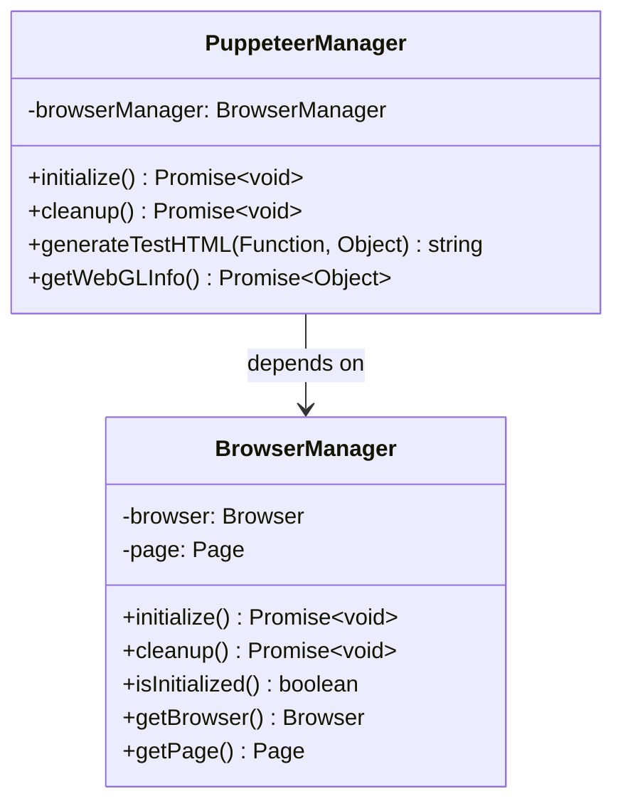

**特徴**:
- ✅ ブラウザの起動・終了管理
- ✅ ページの基本操作
- ✅ 環境の初期化・クリーンアップ
- ✅ エラーハンドリング

### 2.2 機能層 (Feature Layer)
**役割**: 基盤層を使って具体的な機能を提供する中間層

```mermaid
classDiagram
    class HTMLGenerator {
        +generate(options) string
        +generateTestHTML(Function, Object) string
        +generateThreeJsTemplate(Object) string
        -createBaseTemplate() string
        -injectUserScript(string, Function) string
    }
    
    class EnvironmentInspector {
        +getWebGLInfo(BrowserManager) Promise~Object~
        +getBrowserInfo(BrowserManager) Promise~Object~
        +getPerformanceInfo(BrowserManager) Promise~Object~
        +checkWebGLSupport(BrowserManager) Promise~boolean~
    }
    
    class PerformanceTester {
        +measureRenderingPerformance(BrowserManager) Promise~Object~
        +measureFrameRate(BrowserManager) Promise~number~
        +measureMemoryUsage(BrowserManager) Promise~Object~
        +runPerformanceTest(BrowserManager, Function) Promise~Object~
    }
    
    HTMLGenerator -.-> BrowserManager : uses
    EnvironmentInspector --> BrowserManager : requires
    PerformanceTester --> BrowserManager : requires
```

**特徴**:
- ✅ HTMLテンプレート自動生成
- ✅ WebGL環境情報取得
- ✅ レンダリング性能測定
- ✅ ブラウザ機能検証

### 2.3 Three.js層 (Three.js Layer)
**役割**: Three.js専用の高レベル機能を提供する最上位層

```mermaid
classDiagram
    class ThreeTestSuite {
        +initialize() Promise~void~
        +loadThreeScene(Function, Object) Promise~void~
        +runComprehensiveTest() Promise~Object~
        +getVisibleObjects() Promise~Array~
        +validateRendering() Promise~Object~
        -browserManager: BrowserManager
        -sceneInspector: SceneInspector
    }
    
    class SceneInspector {
        +inspectScene(BrowserManager) Promise~Object~
        +getSceneGraph(BrowserManager) Promise~Object~
        +analyzeObjects(BrowserManager) Promise~Array~
        +validateShaders(BrowserManager) Promise~Object~
    }
    
    ThreeTestSuite --> BrowserManager : requires
    ThreeTestSuite --> SceneInspector : aggregates
    SceneInspector -.-> BrowserManager : uses
```

**特徴**:
- ✅ Three.jsシーンの検査・解析
- ✅ 3Dオブジェクト情報取得
- ✅ Three.js専用テスト機能統合
- ✅ 開発者向けAPI提供

### 2.4 テスト独立性層 (Test Independence Layer) 🆕
**役割**: テスト間の独立性を確保し、モック機能を提供

```mermaid
classDiagram
    class MockBrowserManager {
        +initialize() Promise~void~
        +cleanup() Promise~void~
        +getMockPage() MockPage
        +simulateWebGLContext() Object
        -mockBrowser: Object
        -mockPage: Object
    }
    
    class MockWebGL {
        +createMockContext() WebGLRenderingContext
        +simulateWebGLOperations() Object
        +mockShaderCompilation() boolean
        +mockTextureOperations() Object
    }
    
    class TestIsolationHelper {
        +isolateTest(Function) Promise~void~
        +cleanupGlobalState() void
        +resetBrowserEnvironment(BrowserManager) Promise~void~
        +ensureTestIndependence() Promise~void~
    }
    
    class TestDataGenerator {
        +generateSceneData() Object
        +generateMeshData() Object
        +generateMaterialData() Object
        +generateRandomTestData(string) any
    }
    
    class TestUtils {
        +createTestEnvironment() Promise~Object~
        +assertThreeJsObjects(Object, Object) void
        +compareRenderResults(Object, Object) boolean
        +measureTestPerformance(Function) Promise~Object~
    }
    
    MockBrowserManager -.-> BrowserManager : mocks
    MockWebGL -.-> "WebGL Context" : mocks
    TestIsolationHelper --> BrowserManager : manages
    TestUtils --> TestDataGenerator : uses
    TestUtils --> TestIsolationHelper : uses
```

**特徴**:
- ✅ テスト間の完全分離
- ✅ ブラウザリソースのモック化
- ✅ 高速なユニットテスト実行
- ✅ テストデータの自動生成

## 3. クラス関係図

### 3.1 全体アーキテクチャ

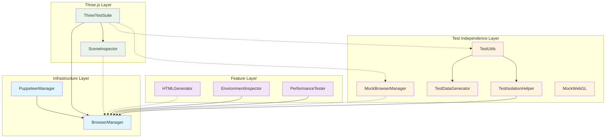

### 3.2 依存関係の詳細

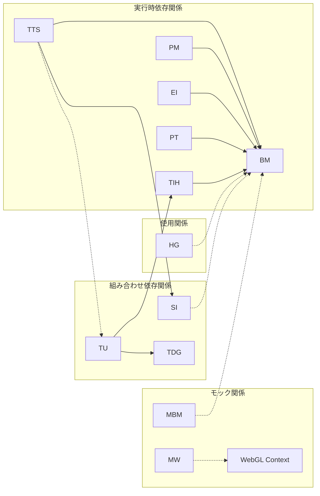

## 4. データフロー図

### 4.1 通常のテスト実行フロー

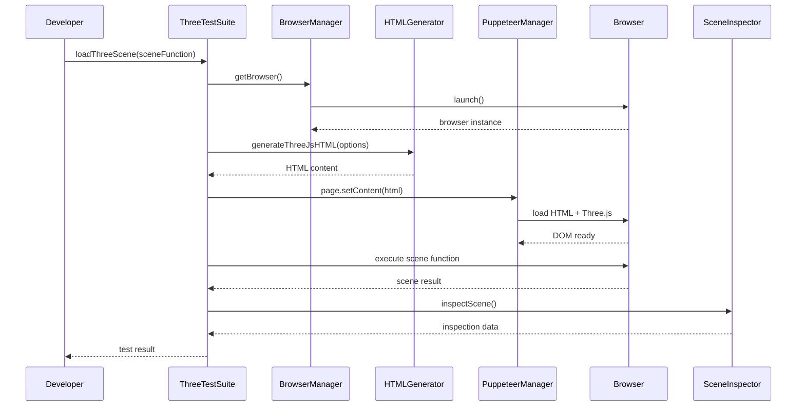

### 4.2 モック使用時のテスト実行フロー

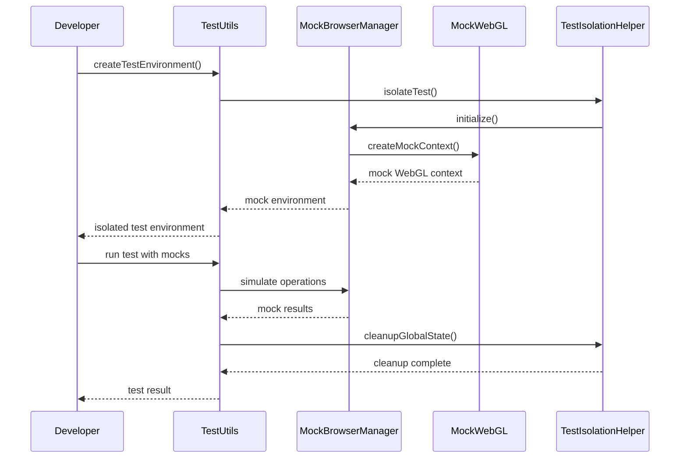

### 4.3 テスト独立性確保のフロー

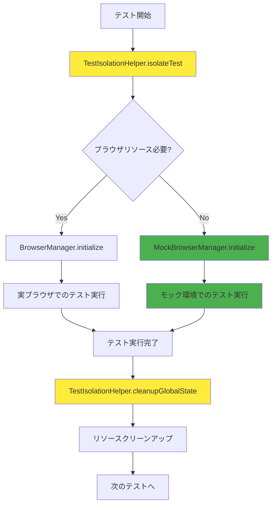

## 5. 依存関係マップ

### 5.1 層間依存関係

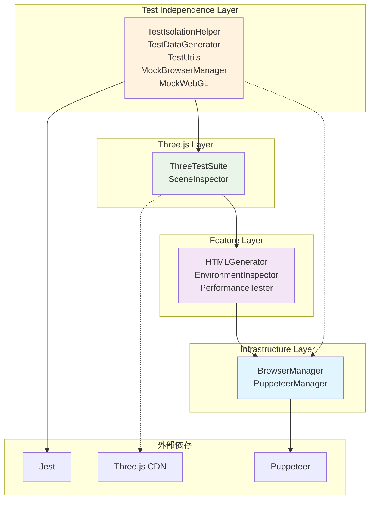

### 5.2 内部クラス間依存関係

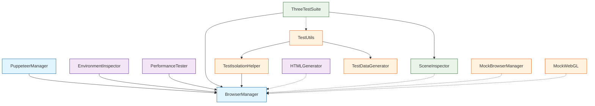

## 6. テスト独立性設計

### 6.1 テスト独立性の実現

Three-test-suiteでは、各テストが完全に独立して実行されるよう、専用のテスト独立性層を導入しています。

#### 独立性が重要な理由
- テスト間でブラウザインスタンスが共有されることを防ぐ
- グローバル状態（`window`オブジェクト等）の汚染を排除
- WebGLコンテキストの状態持ち越しを回避
- 非同期処理のタイミング依存を解消

#### テスト独立性のアプローチ

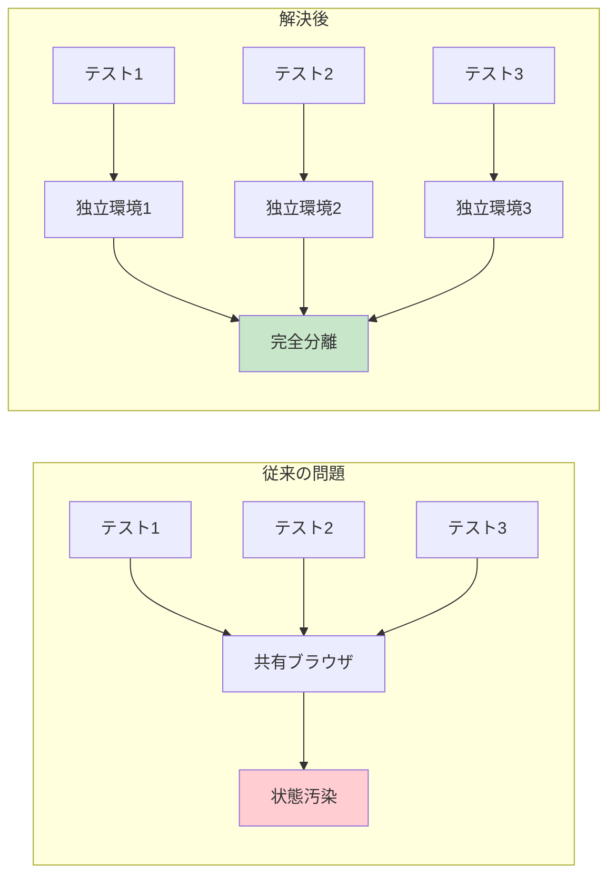

### 6.2 テスト独立性の実現メカニズム

#### TestIsolationHelper による分離制御

```javascript
// 使用例
test('独立したThree.jsテスト', async () => {
  await TestIsolationHelper.isolateTest(async () => {
    const testSuite = new ThreeTestSuite(mockBrowserManager);
    // テストロジック
  });
  // 自動的にクリーンアップ実行
});
```

#### MockBrowserManager による高速化

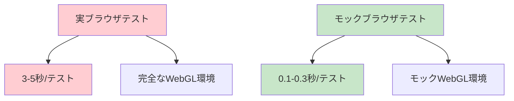

### 6.3 テストタイプ別の使い分け

| テストタイプ | 使用コンポーネント | 実行速度 | 精度 |
|-------------|------------------|----------|------|
| **ユニットテスト** | MockBrowserManager + MockWebGL | ⚡ 高速 | 📊 基本機能 |
| **統合テスト** | BrowserManager + 実環境 | 🐢 低速 | 🎯 高精度 |
| **パフォーマンステスト** | BrowserManager + PerformanceTester | 🐌 最低速 | 📈 最高精度 |

## 7. 拡張ポイント

### 7.1 カスタマイズ可能な箇所

#### 新しい機能層コンポーネントの追加

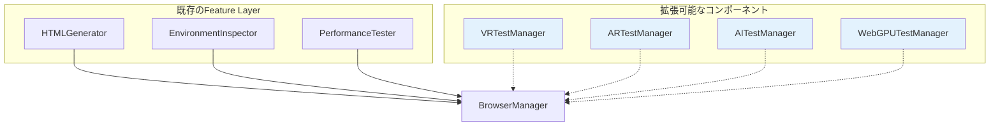

#### カスタムモックの実装

```javascript
// 例: WebGPU モックの追加
class MockWebGPU {
  createMockDevice() {
    return {
      createBuffer: jest.fn(),
      createShaderModule: jest.fn(),
      // WebGPU API のモック実装
    };
  }
}
```

### 7.2 プラグインシステムの設計

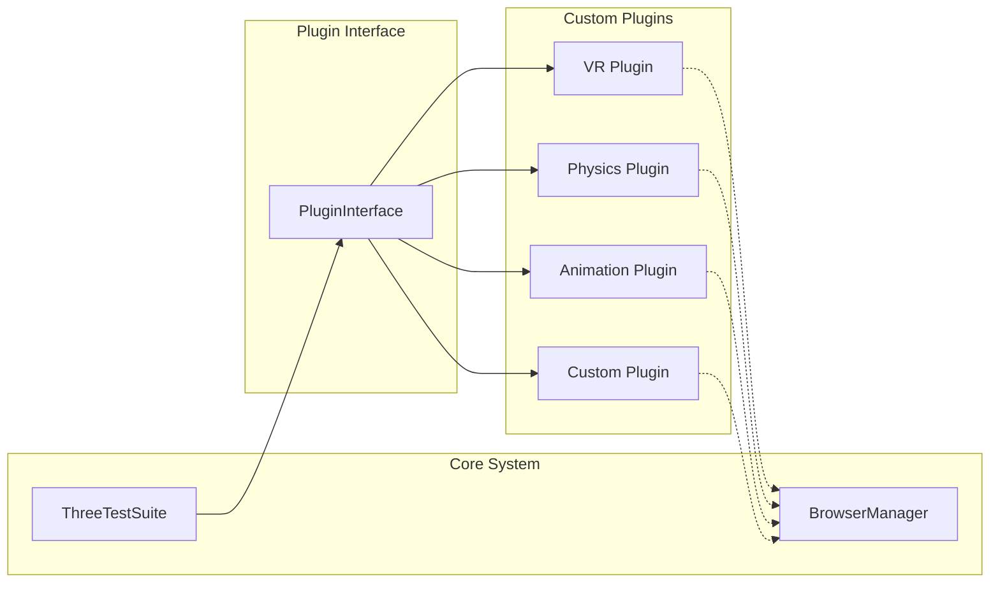

### 7.3 新機能追加時の影響範囲

#### 低影響: 機能層への追加
- 既存テストへの影響: ❌ なし
- 必要な変更: HTMLGenerator への設定追加のみ

#### 中影響: Three.js層への追加
- 既存テストへの影響: ⚠️ 最小限
- 必要な変更: ThreeTestSuite への統合

#### 高影響: 基盤層への変更
- 既存テストへの影響: 🚨 全体
- 必要な変更: 全層での調整が必要

## 8. 設計原則

### 8.1 SOLID原則の適用

#### Single Responsibility Principle (SRP)
```
BrowserManager     → ブラウザ管理のみ
HTMLGenerator      → HTML生成のみ  
ThreeTestSuite     → Three.js統合のみ
TestIsolationHelper → テスト分離のみ
```

#### Open/Closed Principle (OCP)
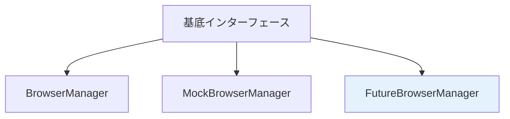

#### Dependency Inversion Principle (DIP)
```javascript
// ❌ 直接依存
class ThreeTestSuite {
  constructor() {
    this.browserManager = new BrowserManager(); // 具象クラスに依存
  }
}

// ✅ 依存注入
class ThreeTestSuite {
  constructor(browserManager) { // インターフェースに依存
    this.browserManager = browserManager;
  }
}
```

### 8.2 テスト駆動設計 (TDD)

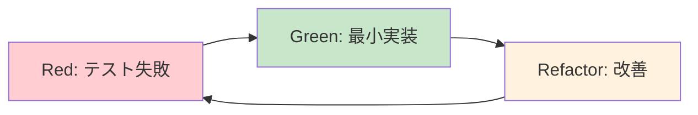

### 8.3 関心の分離と抽象化

#### 抽象化レイヤー
```
開発者インターフェース    ← Three.js Layer
    ↓
ビジネスロジック        ← Feature Layer  
    ↓
技術的実装            ← Infrastructure Layer
    ↓
テスト支援            ← Test Independence Layer
```

#### 関心の分離の利点
- **保守性**: 各層の独立した変更が可能
- **テスト容易性**: 層ごとの単体テストが可能
- **再利用性**: 各コンポーネントの他プロジェクト活用
- **理解しやすさ**: 責任範囲の明確化

### 8.4 パフォーマンス設計

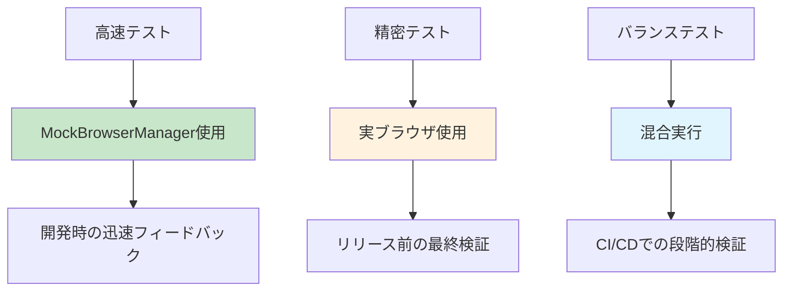

## 9. まとめ

Three-test-suiteの4層アーキテクチャは、以下の核心的価値を提供します：

### 🏗️ アーキテクチャの強み
- **段階的抽象化**: 技術的複雑性を層ごとに管理
- **完全なテスト独立性**: ゼロ依存テストの実現
- **高い拡張性**: プラグインシステムによる機能追加
- **優れたパフォーマンス**: モック活用による高速テスト実行

### 🎯 開発者への価値
- **学習コストの削減**: Three.jsテストロジックに集中
- **開発速度の向上**: IDE支援とテンプレート自動生成
- **高い品質**: 独立したテストによる信頼性確保
- **将来への対応**: VR/AR/WebGPU等への拡張準備

この設計により、Three.jsアプリケーションのテスト開発が劇的に改善され、より高品質なソフトウェアの構築が可能になります。