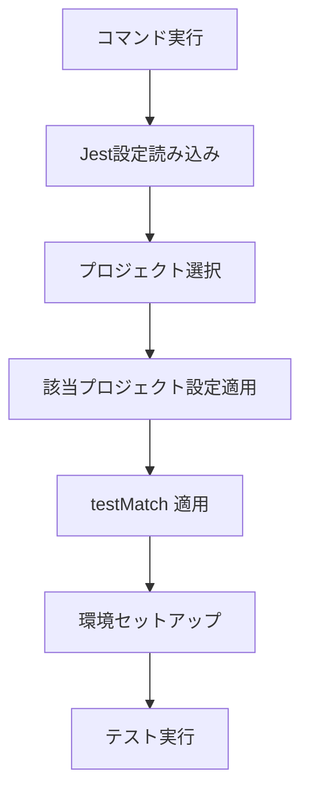

# Jest設定詳細ガイド

このドキュメントは、Web3DExplorerプロジェクトで使用されているJest設定の詳細と、カスタマイズ方法について説明します。

## 📋 目次

1. [3つのプロジェクト構成の詳細説明](#3つのプロジェクト構成の詳細説明)
2. [testMatch パターンの詳細説明](#testmatch-パターンの詳細説明)
3. [環境別実行の仕組み](#環境別実行の仕組み)
4. [設定カスタマイズガイド](#設定カスタマイズガイド)
5. [パフォーマンス最適化](#パフォーマンス最適化)

## 3つのプロジェクト構成の詳細説明

Web3DExplorerでは、テストの性質と実行環境に応じて3つの独立したJestプロジェクトを使用しています。

### 📊 Jest プロジェクト構成概要

```
Web3DExplorer Testing Architecture
├── 🎯 puppeteer-tests (Node.js環境)
├── 🎯 dom-tests (jsdom環境)
└── 🎯 integration-tests (Node.js環境)
```

### 🎯 puppeteer-tests プロジェクト

**💫 目的**: Puppeteer依存のテスト実行  
**🌐 環境**: Node.js  
**🔧 特徴**: ブラウザ制御、WebGL操作、Three.jsシーンのテスト

#### 📁 対象ファイル
```
puppeteer-tests が実行するテストファイル:
├── PuppeteerManager*.test.js
├── BrowserManager*.test.js
├── TestUtils*.test.js
├── EnvironmentInspector*.test.js
├── PerformanceTester*.test.js
├── ThreeTestSuite*.test.js
└── SceneInspector*.test.js
```

#### ⚙️ 設定詳細
```javascript
{
  displayName: "puppeteer-tests",
  testEnvironment: "node",
  testMatch: [
    "**/__tests__/unit/*PuppeteerManager*.test.js",
    "**/__tests__/unit/*BrowserManager*.test.js",
    "**/__tests__/unit/*TestUtils*.test.js",
    "**/__tests__/unit/*EnvironmentInspector*.test.js",
    "**/__tests__/unit/*PerformanceTester*.test.js",
    "**/__tests__/unit/*ThreeTestSuite*.test.js",
    "**/__tests__/unit/*SceneInspector*.test.js"
  ],
  transform: {
    "^.+\\.jsx?$": ["babel-jest", {
      presets: [["@babel/preset-env", { targets: { node: "current" } }]]
    }]
  },
  transformIgnorePatterns: [
    "node_modules/(?!puppeteer)"
  ],
  testTimeout: 60000
}
```

#### 🚀 実行方法
```bash
# Puppeteer関連テストのみ実行
npm run test:puppeteer

# 詳細出力付き
npm run test:puppeteer -- --verbose

# 特定ファイルのみ
npm run test:puppeteer -- --testPathPattern=PuppeteerManager
```

#### 💡 使用例
```javascript
// PuppeteerManager.test.js
describe('PuppeteerManager', () => {
  test('should launch browser and create page', async () => {
    const manager = new PuppeteerManager();
    await manager.launch();
    
    const page = await manager.createPage();
    expect(page).toBeDefined();
    
    await manager.close();
  });
});
```

### 🎯 dom-tests プロジェクト

**💫 目的**: DOM操作テスト実行  
**🌐 環境**: jsdom  
**🔧 特徴**: HTML生成、DOM操作、ブラウザ環境のシミュレーション

#### 📁 対象ファイル
```
dom-tests が実行するテストファイル:
└── HTMLGenerator*.test.js
```

#### ⚙️ 設定詳細
```javascript
{
  displayName: "dom-tests",
  testEnvironment: "jsdom",
  testMatch: [
    "**/__tests__/unit/*HTMLGenerator*.test.js"
  ],
  transform: {
    "^.+\\.jsx?$": ["babel-jest", {
      presets: [["@babel/preset-env", { targets: { node: "current" } }]]
    }]
  },
  setupFilesAfterEnv: ["<rootDir>/jest.setup.js"],
  testTimeout: 30000
}
```

#### 🚀 実行方法
```bash
# DOM関連テストのみ実行
npm run test:dom

# 詳細出力付き
npm run test:dom -- --verbose
```

#### 💡 使用例
```javascript
// HTMLGenerator.test.js
describe('HTMLGenerator', () => {
  test('should generate valid HTML with Three.js script', () => {
    const config = { threeVersion: 'r150' };
    const html = generateTestHTML(config);
    
    // jsdom環境でDOM操作可能
    document.body.innerHTML = html;
    const script = document.querySelector('script[src*="three"]');
    
    expect(script).toBeTruthy();
    expect(script.src).toContain('r150');
  });
});
```

### 🎯 integration-tests プロジェクト

**💫 目的**: 統合機能テスト実行  
**🌐 環境**: Node.js  
**🔧 特徴**: コンポーネント間連携、エンドツーエンドのワークフロー

#### 📁 対象ファイル
```
integration-tests が実行するテストファイル:
└── __tests__/integration/*.test.js
```

#### ⚙️ 設定詳細
```javascript
{
  displayName: "integration-tests",
  testEnvironment: "node",
  testMatch: [
    "**/__tests__/integration/*.test.js"
  ],
  transform: {
    "^.+\\.jsx?$": ["babel-jest", {
      presets: [["@babel/preset-env", { targets: { node: "current" } }]]
    }]
  },
  transformIgnorePatterns: [
    "node_modules/(?!puppeteer)"
  ],
  testTimeout: 120000,  // より長いタイムアウト
  maxWorkers: 1         // 並列実行を無効化
}
```

#### 🚀 実行方法
```bash
# 統合テストのみ実行
npm run test:integration

# より詳細な出力
npm run test:integration -- --verbose --runInBand
```

#### 💡 使用例
```javascript
// integration/full-workflow.test.js
describe('Full Testing Workflow', () => {
  test('should complete end-to-end Three.js testing', async () => {
    // HTMLGenerator + PuppeteerManager + TestUtils の連携
    const html = generateTestHTML({ threeVersion: 'r150' });
    const manager = new PuppeteerManager();
    await manager.launch();
    
    const testResult = await manager.runTest(html, 'scene-creation');
    expect(testResult.success).toBe(true);
    
    await manager.close();
  });
});
```

## testMatch パターンの詳細説明

### 📝 testMatch パターンの仕組み

testMatchは、どのファイルをテスト対象とするかを決定するグロブパターンです。

#### パターン構文の解読
```javascript
"**/__tests__/unit/*PuppeteerManager*.test.js"
```

**詳細解読**:
```
**                    : すべてのディレクトリを再帰的に検索
└── __tests__         : テストディレクトリの名前
    └── unit          : 単体テストサブディレクトリ
        └── *PuppeteerManager*  : ファイル名の一部パターン
            └── .test.js         : テストファイルの拡張子
```

#### 実際のマッチング例

✅ **マッチするファイル**:
```
✓ three-test-suite/__tests__/unit/PuppeteerManager.test.js
✓ three-test-suite/__tests__/unit/MockPuppeteerManager.test.js
✓ three-test-suite/__tests__/unit/ExtendedPuppeteerManager.test.js
✓ src/__tests__/unit/CorePuppeteerManager.test.js
```

❌ **マッチしないファイル**:
```
✗ three-test-suite/__tests__/integration/PuppeteerManager.test.js
  (integration ディレクトリは unit ではない)
  
✗ three-test-suite/__tests__/unit/HTMLGenerator.test.js
  (PuppeteerManager が含まれていない)
  
✗ three-test-suite/__tests__/unit/PuppeteerManager.spec.js
  (.test.js ではなく .spec.js)
  
✗ three-test-suite/src/PuppeteerManager.test.js
  (__tests__ ディレクトリにない)
```

### 🎯 プロジェクト別パターン一覧

```javascript
// puppeteer-tests プロジェクト
testMatch: [
  "**/__tests__/unit/*PuppeteerManager*.test.js",
  "**/__tests__/unit/*BrowserManager*.test.js",
  "**/__tests__/unit/*TestUtils*.test.js",
  "**/__tests__/unit/*EnvironmentInspector*.test.js",
  "**/__tests__/unit/*PerformanceTester*.test.js",
  "**/__tests__/unit/*ThreeTestSuite*.test.js",
  "**/__tests__/unit/*SceneInspector*.test.js"
]

// dom-tests プロジェクト
testMatch: [
  "**/__tests__/unit/*HTMLGenerator*.test.js"
]

// integration-tests プロジェクト
testMatch: [
  "**/__tests__/integration/*.test.js"
]
```

### 🔧 新しいパターンの追加方法

新しいテストタイプを追加する場合の手順：

1. **ファイル命名規則の決定**
   ```javascript
   // 例: WebGL関連テスト
   "*WebGLTester*.test.js"
   ```

2. **適切なプロジェクトへの追加**
   ```javascript
   // puppeteer-tests プロジェクトに追加
   testMatch: [
     // 既存のパターン...
     "**/__tests__/unit/*WebGLTester*.test.js"
   ]
   ```

3. **テストファイルの配置**
   ```
   three-test-suite/
   └── __tests__/
       └── unit/
           └── WebGLTester.test.js  ✓ マッチする
   ```

## 環境別実行の仕組み

### 🔄 プロジェクト選択の流れ

Jest は以下の流れでプロジェクトを選択し実行します：



#### 1. コマンド実行
```bash
npm run test:puppeteer
# ↓ 内部的に実行される
jest --selectProjects=puppeteer-tests
```

#### 2. Jest設定読み込み
```javascript
// jest.config.js から projects 配列を読み込み
module.exports = {
  projects: [
    {
      displayName: "puppeteer-tests",
      // ...設定
    },
    {
      displayName: "dom-tests", 
      // ...設定
    },
    {
      displayName: "integration-tests",
      // ...設定
    }
  ]
};
```

#### 3. プロジェクト選択
```bash
--selectProjects=puppeteer-tests
# ↓ puppeteer-tests の設定のみ使用
```

#### 4. 該当プロジェクト設定適用
```javascript
// puppeteer-tests の設定のみ適用
{
  displayName: "puppeteer-tests",
  testEnvironment: "node",
  testMatch: ["**/__tests__/unit/*PuppeteerManager*.test.js"],
  // ...その他の設定
}
```

#### 5. testMatch 適用
```
指定パターンに一致するファイルのみスキャン:
✓ __tests__/unit/PuppeteerManager.test.js
✗ __tests__/unit/HTMLGenerator.test.js (パターン不一致)
```

#### 6. 環境セットアップ
```javascript
// testEnvironment: "node" で実行環境を設定
// Node.js環境で require, process 等が利用可能
// window, document は未定義
```

#### 7. テスト実行
```
選択されたファイルでテスト実行開始
```

### 🎮 コマンド例と実行フロー

#### 全プロジェクト実行
```bash
npm test
# ↓ 実行フロー
# 1. puppeteer-tests プロジェクト実行
# 2. dom-tests プロジェクト実行  
# 3. integration-tests プロジェクト実行
```

#### 特定プロジェクト実行
```bash
npm run test:puppeteer
# ↓ 実行フロー
# 1. puppeteer-tests プロジェクトのみ実行
# 2. Node.js環境でPuppeteer関連テストのみ実行
```

#### 並列実行の制御
```bash
npm test -- --maxWorkers=1
# ↓ 実行フロー
# 1. 各プロジェクトを順次実行（並列なし）
# 2. メモリ使用量を抑制
```

## 設定カスタマイズガイド

### 🛠️ よくあるカスタマイズパターン

#### 1. タイムアウト調整

**問題**: 重いThree.jsテストでタイムアウトが発生

**解決策**:
```javascript
// jest.config.js の該当プロジェクト内で
{
  displayName: "puppeteer-tests",
  testTimeout: 120000,  // 60000 → 120000 (2分)
  // ...他の設定
}
```

**特定テストのみの調整**:
```javascript
// テストファイル内で
describe('Heavy Three.js Tests', () => {
  jest.setTimeout(180000); // 3分
  
  test('complex scene rendering', async () => {
    // 重いテスト処理
  });
});
```

#### 2. デバッグモード

**目的**: ブラウザの動作を目視確認

**設定方法**:
```javascript
// PuppeteerManager.js 内で環境変数による制御
const browser = await puppeteer.launch({
  headless: process.env.NODE_ENV !== 'debug',
  devtools: process.env.NODE_ENV === 'debug',
  slowMo: process.env.NODE_ENV === 'debug' ? 100 : 0
});
```

**実行方法**:
```bash
NODE_ENV=debug npm run test:puppeteer
```

#### 3. カバレッジ除外

**目的**: テストヘルパーファイルをカバレッジから除外

**設定**:
```javascript
// jest.config.js のルートレベルで
module.exports = {
  collectCoverageFrom: [
    "src/**/*.js",
    "!src/**/*.test.js",
    "!src/test-helpers/**/*.js",  // ヘルパーファイル除外
    "!src/**/mock*.js"           // モックファイル除外
  ],
  projects: [
    // ...プロジェクト設定
  ]
};
```

#### 4. 新しいテストタイプ追加

**例**: VR/ARテスト用のプロジェクト追加

```javascript
// jest.config.js に新プロジェクト追加
{
  displayName: "vr-tests",
  testEnvironment: "node",
  testMatch: [
    "**/__tests__/unit/*VRTester*.test.js",
    "**/__tests__/unit/*ARTester*.test.js"
  ],
  transform: {
    "^.+\\.jsx?$": ["babel-jest", {
      presets: [["@babel/preset-env", { targets: { node: "current" } }]]
    }]
  },
  transformIgnorePatterns: [
    "node_modules/(?!(puppeteer|webxr-api))"
  ],
  testTimeout: 90000,
  setupFilesAfterEnv: ["<rootDir>/jest.vr.setup.js"]
}
```

**対応するnpmスクリプト追加**:
```json
{
  "scripts": {
    "test:vr": "jest --selectProjects=vr-tests"
  }
}
```

#### 5. 環境変数による設定切り替え

**用途**: CI/ローカル環境での設定差分管理

```javascript
// jest.config.js
const isCI = process.env.CI === 'true';

module.exports = {
  projects: [
    {
      displayName: "puppeteer-tests",
      testEnvironment: "node",
      testTimeout: isCI ? 120000 : 60000,  // CIでは長めに設定
      maxWorkers: isCI ? 1 : "50%",        // CIでは並列実行を制限
      // ...他の設定
    }
  ]
};
```

#### 6. カスタムマッチャーの追加

**目的**: Three.js固有のアサーションを追加

```javascript
// jest.setup.js
expect.extend({
  toBeValidThreeJSScene(received) {
    const pass = received && 
                 received.type === 'Scene' && 
                 typeof received.add === 'function';
    
    if (pass) {
      return {
        message: () => `expected ${received} not to be a valid Three.js scene`,
        pass: true,
      };
    } else {
      return {
        message: () => `expected ${received} to be a valid Three.js scene`,
        pass: false,
      };
    }
  },
});
```

**使用例**:
```javascript
// テストファイル内で
test('should create valid scene', () => {
  const scene = new THREE.Scene();
  expect(scene).toBeValidThreeJSScene();
});
```

#### 7. ES Modules 環境でのモック設定

**問題**: ES Modules (ESM) 環境下（例: `package.json` で `"type": "module"` を指定し、テスト実行時に `node --experimental-vm-modules` フラグを使用）では、Jest の標準的なモック機能（`jest.mock` の Hoisting や `__mocks__` ディレクトリによる自動モック）が期待通りに動作しない場合があります。

**解決策**: `jest.unstable_mockModule` API と動的インポート、および適切な Jest 設定を組み合わせることで対応できます。

**設定例 (`jest.config.js`):**
```javascript
// jest.config.js
export default {
  // ... (既存の preset や transform 設定) ...
  globals: {
    'ts-jest': { // ts-jest を使用している場合
      useESM: true,
      isolatedModules: true // モックの安定性に寄与する可能性
    }
  },
  moduleNameMapper: {
    // ESM環境で拡張子なしのインポートを解決する場合など
    '^(\\.{1,2}/.*)\\.js$': '$1',
  }
  // ...
};
```

**テストファイルでの実装例 (`*.test.js`):**
```javascript
// *.test.js
import { jest } from '@jest/globals';
// import OriginalModule from '../src/original-module'; // 通常の静的インポートは避ける

let OriginalModule; // モックされたモジュールを格納する変数
let instanceOfOriginalModule;

beforeAll(async () => {
  // jest.unstable_mockModule でモジュールをモック
  const mocked = await jest.unstable_mockModule('../src/original-module', () => ({
    // OriginalModule がクラスの場合のコンストラクタモック
    OriginalModule: jest.fn().mockImplementation(() => ({
      someMethod: jest.fn().mockReturnValue('mocked value'),
      // ...その他の必要なメソッドをモック...
    })),
    // OriginalModule が関数やオブジェクトをエクスポートしている場合は適宜調整
    //例: namedExportFunction: jest.fn(),
    //    default: jest.fn(), // default export の場合
  }));
  OriginalModule = mocked.OriginalModule;
});

describe('MyComponent using OriginalModule', () => {
  beforeEach(() => {
    // 各テストの前にすべてのモックをクリア
    jest.clearAllMocks();
    // モックされたコンストラクタからインスタンスを生成
    instanceOfOriginalModule = new OriginalModule();
  });

  test('should use mocked OriginalModule', () => {
    // テスト対象コードが instanceOfOriginalModule.someMethod() を呼び出すと仮定
    // const result = myComponent.doSomethingWithOriginalModule(instanceOfOriginalModule);
    // expect(instanceOfOriginalModule.someMethod).toHaveBeenCalled();
    // expect(result).toBe('expected result based on mocked value');
  });
});
```
**ポイント**:
*   `jest.unstable_mockModule` は `beforeAll` などの非同期スコープ内で `await` を使って呼び出します。
*   モックしたいモジュールと、それを使用するテスト対象のモジュールは、`jest.unstable_mockModule` の呼び出し後に動的インポート (`await import(...)`) するか、`beforeAll` で設定された変数を介して参照します。
*   `jest.config.js` の `globals['ts-jest'].isolatedModules: true` 設定が、このアプローチの安定動作に役立つことがあります。

この方法により、ESM 環境でも依存モジュールを効果的にモックし、単体テストの分離性を保つことができます。

## パフォーマンス最適化

### ⚡ 実行速度の改善

#### 1. 並列実行の最適化
```javascript
// jest.config.js
module.exports = {
  maxWorkers: "50%",  // CPUコアの50%を使用
  // または
  maxWorkers: 2,      // 明示的に2ワーカー指定
  
  projects: [
    // 軽いテストは並列実行
    {
      displayName: "dom-tests",
      maxWorkers: "100%"
    },
    // 重いテストは順次実行
    {
      displayName: "puppeteer-tests", 
      maxWorkers: 1
    }
  ]
};
```

#### 2. テストファイル分割
```javascript
// 大きなテストファイルを分割
// BrowserManager.test.js (重い) 
// ↓ 分割
// BrowserManager.basic.test.js (軽い基本テスト)
// BrowserManager.webgl.test.js (重いWebGLテスト)
```

#### 3. セットアップの最適化
```javascript
// beforeAll で共通セットアップを一度だけ実行
describe('PuppeteerManager Tests', () => {
  let manager;
  
  beforeAll(async () => {
    manager = new PuppeteerManager();
    await manager.launch(); // 一度だけブラウザ起動
  });
  
  afterAll(async () => {
    await manager.close(); // 一度だけクリーンアップ
  });
  
  // 各テストでは manager を再利用
});
```

### 🧹 メモリ使用量の最適化

#### 1. 適切なクリーンアップ
```javascript
afterEach(async () => {
  // Three.js オブジェクトのクリーンアップ
  if (scene) {
    scene.traverse((object) => {
      if (object.geometry) object.geometry.dispose();
      if (object.material) {
        if (object.material.map) object.material.map.dispose();
        object.material.dispose();
      }
    });
  }
  
  // Puppeteer ページのクリーンアップ
  if (page && !page.isClosed()) {
    await page.close();
  }
});
```

#### 2. メモリ監視
```javascript
// テスト開始前後でメモリ使用量を記録
beforeEach(() => {
  const memBefore = process.memoryUsage();
  console.log('Memory before test:', memBefore.heapUsed / 1024 / 1024, 'MB');
});

afterEach(() => {
  global.gc && global.gc(); // ガベージコレクション強制実行
  const memAfter = process.memoryUsage();
  console.log('Memory after test:', memAfter.heapUsed / 1024 / 1024, 'MB');
});
```

#### 3. リソースプールの実装
```javascript
// ブラウザインスタンスをプールして再利用
class BrowserPool {
  constructor() {
    this.browsers = [];
    this.maxSize = 3;
  }
  
  async getBrowser() {
    if (this.browsers.length > 0) {
      return this.browsers.pop();
    }
    return await puppeteer.launch();
  }
  
  async returnBrowser(browser) {
    if (this.browsers.length < this.maxSize) {
      this.browsers.push(browser);
    } else {
      await browser.close();
    }
  }
}
```

### 📊 実行時間の測定と分析

#### 1. テスト実行時間の記録
```bash
# 詳細な実行時間を出力
npm test -- --verbose --passWithNoTests

# 最も遅いテストを特定
npm test -- --listTests --verbose
```

#### 2. プロファイリング
```javascript
// jest.config.js でプロファイリング有効化
module.exports = {
  collectCoverage: true,
  coverageReporters: ["html", "text", "lcov"],
  
  // テスト実行時間の詳細出力
  verbose: true,
  
  projects: [
    // プロジェクト設定...
  ]
};
```

#### 3. CI/CDでの最適化
```yaml
# .github/workflows/test.yml
- name: Run tests with optimization
  run: |
    npm test -- --maxWorkers=2 --testTimeout=30000
  env:
    NODE_ENV: ci
```

---

この設定ガイドを参考に、プロジェクトの要件に合わせてJest設定をカスタマイズしてください。適切な設定により、テスト実行の効率性と信頼性を大幅に向上させることができます。
